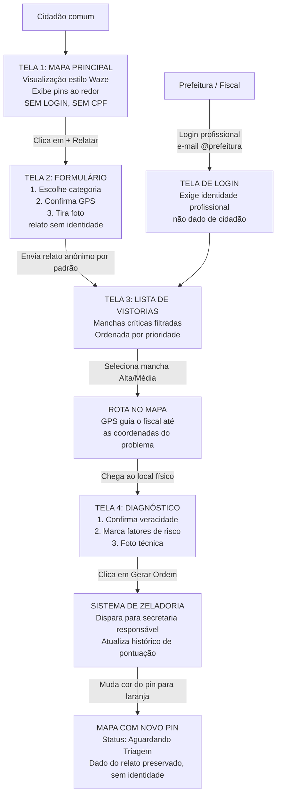

```mermaid
flowchart TD
    A["Cidadão comum"] --> B["TELA 1: MAPA PRINCIPAL<br/>Visualização estilo Waze<br/>Exibe pins ao redor<br/>SEM LOGIN, SEM CPF"]
    B -->|"Clica em + Relatar"| C["TELA 2: FORMULÁRIO<br/>1. Escolhe categoria<br/>2. Confirma GPS<br/>3. Tira foto<br/>relato sem identidade"]
    C -->|"Envia relato anônimo por padrão"| D["TELA 3: LISTA DE VISTORIAS<br/>Manchas críticas filtradas<br/>Ordenada por prioridade"]

    E["Prefeitura / Fiscal"] -->|"Login profissional<br/>e-mail @prefeitura"| F["TELA DE LOGIN<br/>Exige identidade profissional<br/>não dado de cidadão"]
    F --> D

    D -->|"Seleciona mancha Alta/Média"| G["ROTA NO MAPA<br/>GPS guia o fiscal até<br/>as coordenadas do problema"]
    G -->|"Chega ao local físico"| H["TELA 4: DIAGNÓSTICO<br/>1. Confirma veracidade<br/>2. Marca fatores de risco<br/>3. Foto técnica"]
    H -->|"Clica em Gerar Ordem"| I["SISTEMA DE ZELADORIA<br/>Dispara para secretaria responsável<br/>Atualiza histórico de pontuação"]
    I -->|"Muda cor do pin para laranja"| J["MAPA COM NOVO PIN<br/>Status: Aguardando Triagem<br/>Dado do relato preservado, sem identidade"]
```
